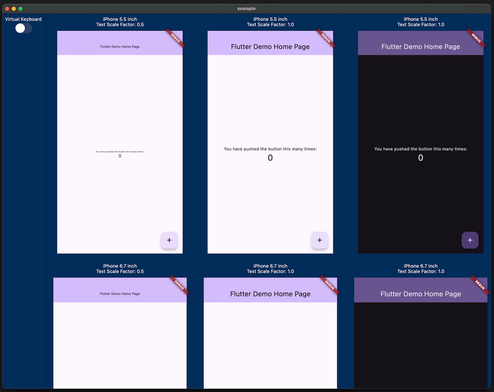

Have you ever experienced your UI breaking when the font size is too large or the screen size of the device is small? Checking for these issues can be a hassle.

This package allows you to preview how your implemented UI will appear on various devices with different screen sizes, text scales, and brightness.

It was inspired by [device_preview](https://pub.dev/packages/device_preview).



## Features

This package provides the following features:

- Preview your UI on various devices with different screen sizes, text scales, and brightness.
- In addition to pre-defined devices like `PreviewDevice.iPhone5_5inch` and `PreviewDevice.android6_7inch`, you can create custom `PreviewDevice` instances.
- Preview your UI when the keyboard is displayed.
- Manipulate each preview individually.
- Friendly with [riverpod](https://pub.dev/packages/riverpod).

## Demo

Check out the demo at [https://kingu-dev.github.io/media_query_preview](https://kingu-dev.github.io/media_query_preview).

## Usage

If you are using [riverpod](https://pub.dev/packages/riverpod), you can do the following.

```dart
// Initialize Provider
final container = ProviderContainer();

final previewDevices = [
  [
    PreviewDevice.iPhone5_5inch(
      textScaleFactor: 0.5,
    ),
    PreviewDevice.iPhone5_5inch(),
    PreviewDevice.iPhone5_5inch(
      brightness: Brightness.dark,
    ),
    PreviewDevice.iPhone5_5inch(
      textScaleFactor: 1.5,
    ),
  ],
  [
    PreviewDevice.iPhone6_7inch(
      textScaleFactor: 0.5,
    ),
    PreviewDevice.iPhone6_7inch(),
    PreviewDevice.iPhone6_7inch(
      brightness: Brightness.dark,
    ),
    PreviewDevice.iPhone6_7inch(
      textScaleFactor: 1.5,
    ),
  ],
  [
    PreviewDevice.android6_7inch(
      textScaleFactor: 0.5,
    ),
    PreviewDevice.android6_7inch(),
    PreviewDevice.android6_7inch(
      brightness: Brightness.dark,
    ),
    PreviewDevice.android6_7inch(
      textScaleFactor: 1.5,
    ),
  ]
];

runApp(
  MediaQueryPreview(
    previewDevices: previewDevices,
    builder: (_, previewDevice) => UncontrolledProviderScope(
      container: ProviderContainer(
        parent: container,
      ),
      child: MyApp(
        targetPlatform: previewDevice.targetPlatform,
      ),
    ),
  ),
);
```

If you are not using [riverpod](https://pub.dev/packages/riverpod), it is even simpler.

```dart
runApp(
  MediaQueryPreview(
    previewDevices: previewDevices,
    builder: (_, previewDevice) => MyApp(
      targetPlatform: previewDevice.targetPlatform,
    ),
  ),
);
```

## Attention

- It is recommended to use this package only development. Please do not use it in production.
- This package allows you to display multiple instances of the Widget you implemented at the same time, which may lead to poor performance or issues with state management. In particular, it may not work properly if you are using global objects or `GlobalKey`.

## Future

If you have Apple Vision Pro, you can use it as a "Designed for iPad" app. This is the future!


